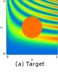
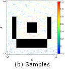
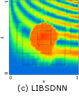
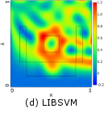

# Summary

A selective desensitization neural network (SDNN) is a shallow learning-based function approximator that has high expression and generalization abilities. Besides, it is very robust against irrelevant features and its hyperparameters do not affect the performance significantly.
Thus, An SDNN can be used for various tasks without requiring accurate feature selection and hyperparameter optimization, so that it can be used easier than several machine learning models, such as a support vector machine.

However, the implementation of SDNN is not so easy for general users since it requires two unique operations, namely, ``pattern coding`` and ``selective desensitization.`` These operations are not included in any existing library, and the tricks to reduce the execution time of SDNN have not been published.

To facilitate the implementation and application of SDNN, we developed a library called ``LIBSDNN,`` including the class library for C++, Mex files for MATLAB, and some command-line tools for training and evaluation.

# Introduction

Although deep learning has achieved great success in various fields, it generally requires a large amount of data and has a high computational cost; moreover, non-experts face difficulties using it to its full potential. In contrast, ``shallow learning``, in which only one (usually the last) layer is trained, requires a much lesser amount of data, has low computational cost, and is still useful for many application.

A representative learning machine with shallow learning is a support vector machine (SVM), which is very popular for the classification of extracted features. However, the performance of an SVM depends sensitively on the type of kernel and the hyperparameters. Its performance can degrade without hyperparameter optimization, which requires considerable effort; the performance can also degrade when the input vector contains irrelevant features [@Weston:2000] or when regions with largely different properties (such as density of training samples and complexity of decision boundaries) coexist. These shortcomings are more prominent in the regression version of an SVM, that is, support vector regression (SVR).

Another type of shallow neural network that overcomes these problems is a selective desensitization neural network (SDNN). An SDNN is a parallel perceptron (PP) [@Auer:2008] with two fixed preprocessing layers, in which two operations, namely, ``pattern coding`` [@Tanno:2015] and ``selective desensitization`` [@Morita:2005] are performed instead of kernel transformation (Please refer to SDNN section for more details). The PP part consists of some simple perceptrons (SPs) and represents the value of a function as the sum of the outputs of the SPs. Although each SP is a linear binary classifier, it can form very complex decision boundaries in the original input space because of the two abovementioned operations.

An SDNN provides high expression and generalization abilities. For example, it can approximate a complicated two-variable function with some discontinuous points, even for the areas where no training samples are provided [@Nonaka:2011] (also see Section 3). An SDNN has been applied for hand gesture recognition [@Kawata:2010] and hand motion speed estimation [@Horie:2014] from surface electromyogram signals, for which it shows superior ability for approximating higher-dimensional functions. It has also been proven to be suitable for online approximation of the value function in continuous state-action Q-learning[@Kobayashi:2014].

One of the important advantages of an SDNN is its robustness against irrelevant features or redundant input dimensions [@Kobayashi:2015;@Tanno:2017]. Although extra dimensions increase the computational cost (second-order of the number of input dimensions), they have only a slight influence on the performance. Accordingly, we can save the effort required for performing feature selection or dimensionality reduction. 

Another characteristic advantage of an SDNN is that the hyperparameter setting is easy. This is because its structure and learning algorithm are rather simple, and there exist only a few hyperparameters. Moreover, although its expression ability depends on and increases with the number of neural elements, overfitting does not occur because redundant elements are virtually unused or play the same role as other elements. The other hyperparameters do not affect the performance much if their values satisfy certain conditions (see "Selective desensitization neural network.pdf" in &frasl;doc folder). Accordingly, extensive hyperparameter search is unnecessary and we can use fixed hyperparameters or at most attempt several settings. Furthermore, even if the regions with different properties and optimal hyperparameters are mixed, the performance does not degrade much for any of the regions.

Because of these advantages, an SDNN is a very practical function approximator suitable for various (but not very high-dimensional) tasks, including pattern classification. However, the implementation of an SDNN is difficult for general users because the pattern coding and selective desensitization operations are unique and not included in any existing library or development environment for machine learning. In addition, general users may face difficulty in writing an efficient program code because there exist many unpublished tricks to reduce the execution time greatly.

We have therefore developed an SDNN library to facilitate the implementation and application of an SDNN and named it ``LIBSDNN``. This library is written in C++ and provides very efficient codes for implementing SDNNs, including those for distributed computation (OpenMP). Some research on the performance of SDNN has been conducted using our library [@Ichiba:2019;@Someno:2019], and we are conducting some application research with it.

In the following sections, we demonstrate the performance of the library by comparison with LIBSVM, a popular library for SVM and SVR. Please refer to the documents in the LIBSDNN package, for more information on SDNN itself and the usage of LIBSDNN.

# Performance of LIBSDNN

To demonstrate the performance of LIBSDNN and the SDNN itself, we perform a task of approximating a two-variable discontinuous function with various spatial frequencies depending on the area (Formula (1); Figure 1(a)); this was also shown in the study by Nonaka et al. [@Nonaka:2011]. The source code and the parameter files of this demonstration are provided in the LIBSDNN library package. Please check the libsdnn\\command line tools\\example folder.

$$
f(x) = \left\{
\begin{array}{ll}
1 & ((x-0.5)^2+(y-0.5)^2 \leq 0.04) \\
\frac{1+x}{2}\sin^{2}(6\pi xy^{2}) & (otherwise)
\end{array}
\right.\tag{1}
$$

where $x,y \in [0,1]$.

We randomly chose 2000 points from the 1001×1001 lattice points except for the blank areas, as shown in Figure 1(b); we used those as training samples. After the SDNN learned the training sample 300 times, it estimated the output for all points.

   

Figure 1. Performance of LIBSDNN and LIBSVM in a two-variable function approximation task

Figure 1(c) shows the estimation result. We can see that the SDNN approximates the target function properly even in the blank areas, indicating a very high generalization ability. The approximation error (root mean squared error (RMSE)) was 0.0859. As for the computational cost of LIBSDNN, the training process took about 240 s and required 8 MB of memory resources.

We compared the above performance with LIBSVM [@Chang:2007], which is one of the most popular and effective approximation libraries and can also be used for SVR. In this comparison, the radial basis function was used as the kernel of SVR and its parameters, (C, $\gamma$, p), were optimized by the grid search method and were set to ($2^5$, $2^5$, 0.005).

The RMSE for the LIBSVM was 0.2136, which is more than twice of that for LIBSDNN. In particular, the approximation error was markedly large in the center blank area and the upper right area where the target function had a high spatial frequency, as shown in Figure 1(d). LIBSVM also had higher computational cost (Table 1). For your information, the comparison experiment was run on a 64-bit machine with Intel Core i7-3770K CPU (3.50 GHz, 4-core), 8
MB cache, and 32 GB main memory.

Table 1. Comparison between LIBSDNN and LIBSVM in approximating a two-variable function 

|Libraries|LIBSDNN|LIBSVM|
|----|----|----|
|RMSE|0.0859|0.2136|
|Time for modeling (training and grid search)|240s|530s (grid search included)|
|Memory requirements per model|8MB|14MB|

# Conclusion
LIBSDNN is a library for SDNN, which provides easy-to-use and efficient codes of SDNNs and superior performance compared to LIBSVM for some pattern classification and function approximation tasks. We hope that this library helps general users implement SDNNs so that it can be widely used in various fields.

# Acknowledgements
The authors would like to thank T. Kobayashi for providing several pieces of advice. This work was partly supported by JSPS KAKENHI grant numbers JP22300079, JP24700593, and JP18H03304 and by Tateishi Science and Technology Foundation grant number 2157011.

# References
